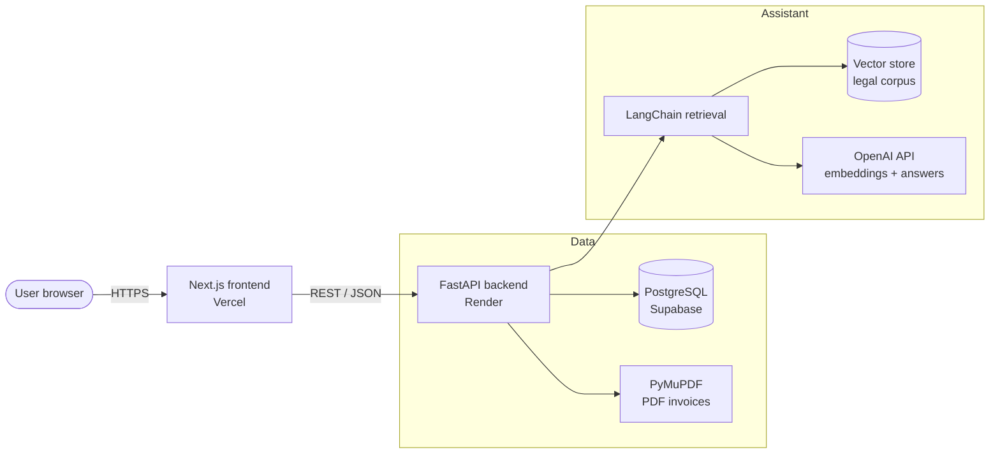
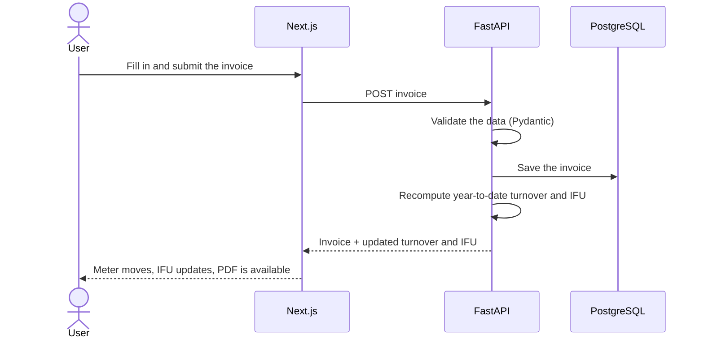
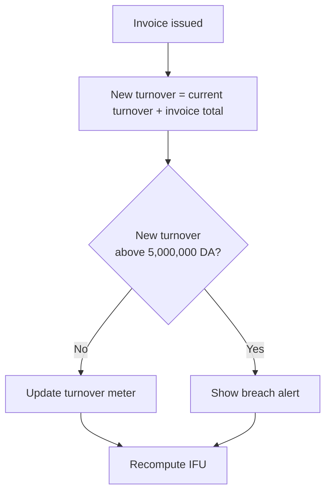
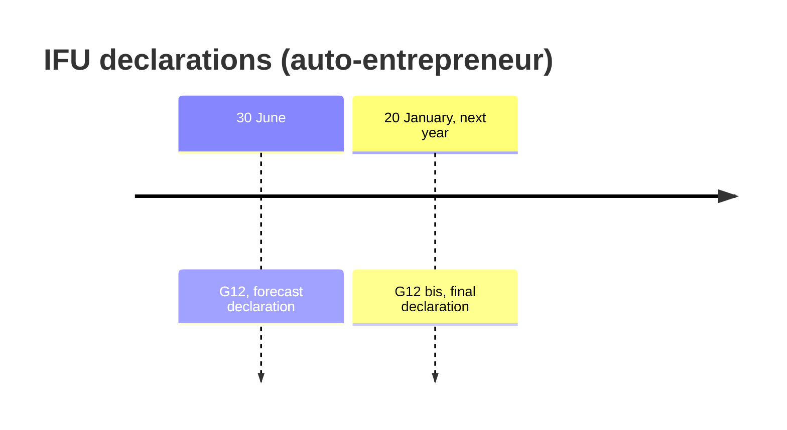
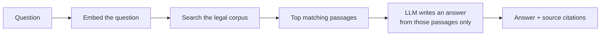

<div align="center">

# MoukawilOS

### The fiscal workspace for Algerian auto-entrepreneurs

Invoices in **Arabic (RTL), French and English** · a live **5,000,000 DA ceiling** tracker · **IFU** calculation · declaration **deadline countdowns** · a regulatory assistant that **cites its sources**

[**▶ Try the live demo**](https://moukawil-os.vercel.app) &nbsp;·&nbsp; [**🎬 Watch the demo video**](TODO-VIDEO-URL) &nbsp;·&nbsp; [**📦 Code**](https://github.com/AYA-BACHA/MoukawilOS)


<!-- TODO: replace with a real screenshot or GIF of the dashboard -->


</div>

---

## Table of contents

1. [The problem](#1-the-problem)
2. [What MoukawilOS does](#2-what-moukawilos-does)
3. [Try it in 30 seconds](#3-try-it-in-30-seconds)
4. [Screenshots](#4-screenshots)
5. [How it works](#5-how-it-works)
6. [The fiscal rules we implement](#6-the-fiscal-rules-we-implement)
7. [The regulatory assistant](#7-the-regulatory-assistant)
8. [Tech stack](#8-tech-stack)
9. [Run it locally](#9-run-it-locally)
10. [Project structure](#10-project-structure)
11. [Team](#11-team)
12. [How we used AI](#12-how-we-used-ai)
13. [Known limitations](#13-known-limitations)
14. [Roadmap](#14-roadmap)
15. [Security](#15-security)
16. [Disclaimer](#16-disclaimer)
17. [License](#17-license)
18. [Sources](#18-sources)

---

## 1. The problem

Law 22-23 of 18 December 2022 created the **auto-entrepreneur** status in Algeria, letting freelancers and independent service providers work legally under a flat **0.5% IFU** (Impôt Forfaitaire Unique).

Keeping the status, however, takes constant manual care:

| Obligation   |Why it is easy to get wrong |
|---|---|
| Stay under the **5,000,000 DA** annual turnover ceiling | Turnover is tracked by hand across invoices and payments |
| Pay the right IFU | 0.5% of turnover, **with a 10,000 DA minimum** |
| File the **G12** and **G12 bis** declarations | Two different forms with two different dates |
| Issue invoices that carry the seller's identifiers | Usually written by hand in Word or Excel |

Most people manage this in spreadsheets, where one mistake can lead to penalties or loss of the status.

> **Who it is for:** freelancers and digital service providers registered with ANAE (Agence Nationale de l'Auto-Entrepreneur).

<!-- TODO (only if true): add one sentence of real user evidence, e.g.
"We interviewed N auto-entrepreneurs; X of them track their turnover in Excel." -->

---

## 2. What MoukawilOS does

<!-- TODO: set each Status honestly: ✅ works end to end, 🚧 partial, ❌ not built. Delete rows that do not exist. -->

| Feature | What it does | Status |
|---|---|---|
| **Multilingual invoicing** | Create invoices in Arabic (right-to-left), French and English, with seller identifiers (NIF, NIS, auto-entrepreneur card number) | TODO |
| **Turnover meter** | Adds each invoice to the year's turnover and shows progress toward the 5,000,000 DA ceiling | TODO |
| **IFU calculation** | Computes `max(0.5% × turnover, 10,000 DA)` on the server | TODO |
| **Deadline countdowns** | Days remaining until the G12 (30 June) and G12 bis (20 January) | TODO |
| **Regulatory assistant** | Answers questions about the status with citations from indexed Algerian texts | TODO |
| **Instant guest demo** | One click loads a populated sample account, with no sign-up | TODO |

---

## 3. Try it in 30 seconds

1. Open **https://moukawil-os.vercel.app**
2. Click **"Instant Guest Demo"**. No account is needed.
3. Click **New Invoice**, add a line item and issue it.
4. Watch the **turnover meter** and the **IFU amount** update.
5. Switch the invoice preview between **Arabic, French and English**.
6. Ask the assistant: *"Which activities can I carry out as an auto-entrepreneur?"*

> The API runs on a hosting tier that may need a few seconds to wake up on the first request. <!-- TODO: delete this line if you use a paid or always-on tier -->

---

## 4. Screenshots

<!-- TODO: capture these, save them in docs/screenshots/, and keep the file names (or edit the paths). -->

| Dashboard and turnover meter | Invoice editor |
|---|---|
|  |  |

| Arabic (RTL) invoice | French / English invoice |
|---|---|
|  |  |

| Compliance tab (IFU and deadlines) | Regulatory assistant |
|---|---|
|  |  |

---

## 5. How it works

### Architecture



<!-- TODO: state which vector store you really use (pgvector or FAISS) in the tech stack table in section 8. -->

### What happens when you issue an invoice



<!-- TODO: check this sequence matches your real endpoints and rename the steps if they differ. -->

---

## 6. The fiscal rules we implement

All figures below were checked against public sources (see [Sources](#18-sources)). Tax rules change, so the app shows them as reference values and the assistant stamps its answers with an "as of" date. <!-- TODO: remove the "as of" part if you have not built it -->

| Rule | Value | Notes |
|---|---|---|
| IFU rate, auto-entrepreneur | **0.5%** of turnover | Reduced from 5% by the 2024 Finance Law |
| Minimum IFU | **10,000 DA** per year | Applies even if 0.5% of turnover is lower |
| Annual turnover ceiling | **5,000,000 DA** | TODO: confirm the exact wording and source, since some sources give a different ceiling for commerce activities |
| G12, forecast declaration | Due **30 June** | Declaration of expected turnover |
| G12 bis, final declaration | Due **20 January** of the next year | Declaration of actual turnover |

> **Note on the G12.** Whether the G12 applies to a given auto-entrepreneur has varied: ANAE told its members they were exempt for 2024, while 2026 sources list auto-entrepreneurs under the G12. The countdown is therefore a reference, and users should confirm with their tax office.

### The IFU formula

```
IFU due = max( 0.005 × annual turnover , 10,000 DA )
```

| Annual turnover | 0.5% of turnover | **IFU due** |
|---:|---:|---:|
| 1,000,000 DA | 5,000 DA | **10,000 DA** (minimum applies) |
| 2,000,000 DA | 10,000 DA | **10,000 DA** |
| 3,000,000 DA | 15,000 DA | **15,000 DA** |
| 5,000,000 DA | 25,000 DA | **25,000 DA** |

Amounts are handled with exact decimal arithmetic on the server. <!-- TODO: confirm you use Python Decimal and not float -->

### Ceiling logic



<!-- TODO: add your warning levels here only if the code really uses them (for example 75% / 90%). -->

### Declaration calendar



---

## 7. The regulatory assistant

The assistant answers questions about the auto-entrepreneur status and **shows the source** it used.

### What is indexed

<!-- TODO: list ONLY the files that are really in your retrieval folder. Delete rows you did not index. -->

| Text | Reference | Covers |
|---|---|---|
| Law No. 22-23 | 18 December 2022 | Creates the auto-entrepreneur status |
| Executive Decree No. 23-197 | 25 May 2023, Journal Officiel No. 37 of 4 June 2023 | Qualifying activities and registration with ANAE |
| TODO: Finance Law 2024 provisions on the IFU | TODO | Reduced 0.5% rate |

### How it answers



- **Cited answers.** Each answer points to the text and article it came from.
- **Source-first.** <!-- TODO: keep only if true --> If no relevant passage is found, the assistant says so instead of guessing.
- **Not legal advice.** See the [disclaimer](#16-disclaimer).

---

## 8. Tech stack

<!-- TODO: copy the exact versions from package.json and requirements.txt. Delete anything you do not use. -->

| Layer | Technology | Purpose |
|---|---|---|
| Frontend | Next.js, React, TypeScript, Tailwind CSS, Lucide Icons | Dashboard, invoice editor, RTL and LTR layouts |
| Backend | Node.js, Express, TypeScript / FastAPI, Python 3.11 | REST API, validation, fiscal calculations & RAG microservice |
| Database | PostgreSQL on Supabase | Invoices, clients, turnover |
| Documents | PyMuPDF | PDF invoice generation |
| Retrieval | LangChain, pgvector | Search over the legal corpus |
| AI in the product | OpenAI API (`text-embedding-3-small`, `gpt-4o-mini`) | Embeddings and cited answers |
| Hosting and CI | Vercel (frontend), Render (API), GitHub Actions | Deployment and automated checks |

---

## 9. Run it locally

### Prerequisites

| Tool | Version |
|---|---|
| Node.js | TODO (see `package.json`, field `engines`) |
| Python | 3.11 or newer |
| Git | any recent version |
| PostgreSQL | a local instance, or a free Supabase project |
| OpenAI API key | needed for the assistant only |

### 1. Clone

```bash
git clone https://github.com/AYA-BACHA/MoukawilOS.git
cd Moukawil-OS
```

### 2. Backend

```bash
cd TODO-backend-folder
python3 -m venv .venv
source .venv/bin/activate            # Windows: .venv\Scripts\activate
pip install -r requirements.txt
cp .env.example .env                 # then fill in the values
# TODO: add your migration or seed command here, if you have one
uvicorn TODO.main:app --reload --port 8000
```

The API docs open at <http://localhost:8000/docs>.

### 3. Frontend (in a second terminal)

```bash
cd TODO-frontend-folder
npm install
cp .env.example .env.local           # then fill in the values
npm run dev
```

Open <http://localhost:3000>.

### Environment variables

<!-- TODO: make this table match your real .env.example files exactly. -->

| Variable | Where | Description |
|---|---|---|
| `DATABASE_URL` | backend | PostgreSQL connection string |
| `OPENAI_API_KEY` | backend | Key for embeddings and answers |
| `ALLOWED_ORIGINS` | backend | Frontend URL allowed by CORS |
| `NEXT_PUBLIC_API_URL` | frontend | Base URL of the backend API |

> Never commit real values. Only `.env.example` files with placeholders belong in the repository.

---

## 10. Project structure

<!-- TODO: replace with the output of `tree -L 3 -I 'node_modules|.venv|.next|__pycache__'` and add one comment per folder. -->

```
moukawil-os/
├── frontend/                 # Next.js app
├── backend/                  # Express REST API
├── rag/                      # FastAPI regulatory RAG service
├── database/                 # Supabase & PostgreSQL migrations
├── docs/                     # Canonical documentation & specs
├── .github/workflows/        # CI / CD
├── .gitignore
└── README.md
```

---

## 11. Team

<!-- TODO: full names, and one honest line each about what the person really built. -->

| Name | Role | What they built |
|---|---|---|
| **Bacha Aya** | Product Lead and Frontend | Web app, UI system, client-side state, multilingual invoicing (Arabic RTL, French, English) |
| TODO: full name | Backend | TODO: for example API endpoints, database schema, IFU and ceiling logic |
| TODO: full name | Data and DevOps | TODO: for example legal-text retrieval pipeline, CI/CD, deployment |

---

## 12. How we used AI

We used AI in two ways, and we want to be clear about both.

| | Tools | Role |
|---|---|---|
| **Inside the product** | OpenAI API | Embeddings and cited answers in the regulatory assistant |
| **While building it** | TODO: list every tool you used, for example GitHub Copilot, Claude, Gemini | Code assistance, drafting and review. Every change was reviewed by a team member. <!-- TODO: only keep the last sentence if true --> |

---

## 13. Known limitations

<!-- TODO: this is the most important section for honesty. Keep only what is true, add what is missing. Examples of what usually belongs here: -->

- TODO: for example, "Authentication is limited. The guest demo uses sample data."
- TODO: for example, "Arabic PDF output is tested on X but not on all PDF viewers."
- TODO: for example, "The legal corpus covers only the texts listed in section 7."
- TODO: for example, "Fiscal rules are hard-coded and must be updated by hand when the law changes."

---

## 14. Roadmap

| When | Milestone |
|---|---|
| Next 3 months | **Private beta** with 50 Algerian auto-entrepreneurs in software, design and digital consulting |
| Next 3 months | **One-click G12 / G12 bis exports**, pre-filled from the user's invoices |
| Next 3 months | **BaridiMob and bank-statement import**, so turnover logs itself |
| Next 3 months | **Larger legal corpus**, and an "as of" date on every assistant answer |
| Before public launch | Review of the fiscal rules by a qualified accountant |

---

## 15. Security

- Secrets live only in environment variables. `.env` and `.env.local` are listed in `.gitignore`.
- No API keys or database credentials are committed.

To check your own clone:

```bash
git ls-files | grep -E '(^|/)\.env($|\.local$)'      # should print nothing
```

---

## 16. Disclaimer

MoukawilOS provides general information and tools for administrative guidance. It is **not legal or tax advice**. Laws and rates change, and AI-generated answers can be incomplete or out of date. Confirm important decisions with the tax administration, ANAE, CASNOS or a qualified professional.

---

## 17. License

TODO: choose a license (for example MIT) and add a `LICENSE` file.

---

## 18. Sources

- Law No. 22-23 of 18 December 2022 (auto-entrepreneur status)
- Executive Decree No. 23-197 of 25 May 2023, Journal Officiel No. 37 of 4 June 2023 (qualifying activities and registration)
- Finance Law 2024 (0.5% IFU rate for auto-entrepreneurs)
- Official G12 and G12 bis forms and deadlines, Direction Générale des Impôts (DGI)
- ANAE: <https://anae.dz> and the ANAE communications on the G12 declaration

<!-- TODO: link the exact Journal Officiel (joradp.dz) and DGI pages you relied on. -->
