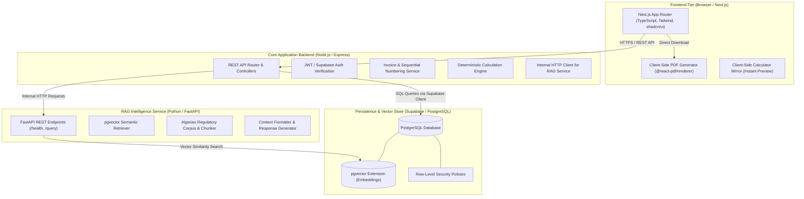

# MoukawilOS — System Architecture

> **Status:** Sprint 0 Baseline Architecture  
> **Architecture Pattern:** Decoupled Monorepo (Client Presentation Tier, Core API Backend, Specialized AI Microservice, Centralized Relational & Vector Persistence)

---

## 1. High-Level Architecture Diagram

---

## 2. Service Responsibilities

### 2.1. Frontend (`frontend/`)
- **Technology:** Next.js (App Router), TypeScript, Tailwind CSS, shadcn/ui, `@react-pdf/renderer`.
- **Core Responsibilities:**
  - Rendering responsive user interfaces for Dashboard, Invoices, Compliance, Regulatory Assistant, and Settings.
  - Client-side form management and synchronous validation (e.g., verifying 15-digit NIF format).
  - Client-side PDF generation using `@react-pdf/renderer` to generate and download legally compliant Algerian invoices directly in the browser without server load.
  - Multilingual presentation supporting French (default), Arabic with dynamic RTL (`dir="rtl"`), and English.
  - Visual feedback for statutory thresholds (80% preventative warning, 5M DZD ceiling gauge).

### 2.2. Backend (`backend/`)
- **Technology:** Node.js (v24), TypeScript, Express (REST API architecture).
- **Core Responsibilities:**
  - Primary API orchestration and business rule enforcement.
  - Enforcing strict sequential invoice numbering (`FA-YYYY-NNN`) and credit note numbering (`AV-YYYY-NNN`) without gaps or collisions.
  - Enforcing invoice immutability: blocking `PUT`/`PATCH`/`DELETE` operations on finalized invoices.
  - Server-side deterministic calculation engine for IFU tax (0.5%, min 10,000 DZD), CASNOS contributions (Forfait 24,000 DZD or 15% general regime), and annual turnover aggregation.
  - Authenticating client requests and managing database interactions via Supabase client.
  - Relaying regulatory assistant queries to the Python RAG microservice via internal HTTP calls.

### 2.3. RAG Service (`rag/`)
- **Technology:** Python (3.13), FastAPI, Uvicorn, Pydantic.
- **Core Responsibilities:**
  - Microservice dedicated exclusively to regulatory knowledge retrieval and query augmentation.
  - Ingesting and maintaining the verified Algerian legal corpus (Journal Officiel, Loi n° 22-23, CIDTA articles, Décrets exécutifs 23-196, 23-197, 15-289, 26-257, 05-468).
  - Converting legal chunks into dense vector embeddings.
  - Executing vector similarity search queries against `pgvector`.
  - Formatting prompts with retrieved context and generating accurate, attributed answers.
  - Enforcing verification status tags (`verified-official`, `secondary-only`, `conflicting`, `unknown`) and serving the intellectual honesty fallback when a query is out of verified scope.

### 2.4. Database (`database/`)
- **Technology:** PostgreSQL (hosted on Supabase) + `pgvector` extension.
- **Core Responsibilities:**
  - Relational storage for users, freelancer profiles, clients, invoices, invoice line items, and payment logs.
  - Vector embedding storage for regulatory documents using the `pgvector` extension.
  - Enforcing data isolation and security through PostgreSQL Row-Level Security (RLS) policies.
  - Managing incremental migrations (`database/migrations/`), raw schema blueprints (`database/schema/`), and initial seed data (`database/seeds/`).

---

## 3. Communication Protocols & Security Boundaries

1. **Client to Backend Communication:**
   - Standard HTTPS REST API calls with JSON payloads.
   - User identity authenticated via bearer tokens issued by Supabase Auth.
2. **Backend to Database Communication:**
   - Authenticated PostgreSQL connection over SSL via Supabase service client.
   - Operations respect Row-Level Security (RLS) where user context is passed.
3. **Backend to RAG Service Communication:**
   - Internal microservice HTTP communication (e.g., `POST http://localhost:8000/query` in local development; private network in deployment).
   - RAG service does not expose direct public database mutation endpoints.
4. **Environment Isolation:**
   - All credentials and sensitive connection strings reside strictly in local `.env` files (ignored by Git).
   - Only `.env.example` templates with variable names are committed to version control.
