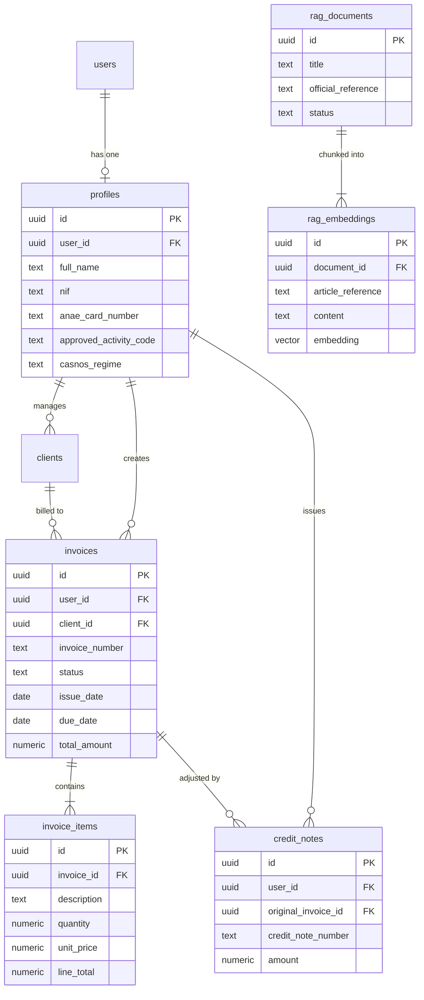

# MoukawilOS — Database Architecture & Schema Specification

> **Status:** Canonical Specification — Sprint 0 Baseline  
> **Engine:** Supabase PostgreSQL 15+ with `pgvector` extension  
> **Source of Truth:** Aligned with [`docs/developer-handoff.md`](developer-handoff.md) and [`docs/legal-sources.md`](legal-sources.md).

---

## 1. Architectural Overview & Design Principles

MoukawilOS utilizes a multi-tenant relational schema on Supabase PostgreSQL. Key architectural invariants include:
1. **Row-Level Security (RLS):** Every tenant table enforces tenant isolation via `auth.uid() = user_id`.
2. **Canonical State Integrity:** Invoices strictly follow `DRAFT` → `ISSUED` → `PAID` / `CREDITED`.
3. **Database-Level Immutability:** Finalized invoices (`issued`, `paid`) are locked against unauthorized `UPDATE` or `DELETE` using PostgreSQL trigger constraints.
4. **Single Currency Invariant:** All financial amounts are stored as exact fixed-point `NUMERIC(14, 2)` in Algerian Dinars (`currency = 'DZD'`). No floating-point types (`FLOAT`, `DOUBLE PRECISION`) are permitted.
5. **Vector Store Integration:** Official regulatory texts are chunked and stored in `rag_embeddings` using `vector(1536)` (or `vector(384)`) with HNSW indexing for rapid cosine similarity search.

---

## 2. Entity-Relationship Model



---

## 3. Relational Schema Definitions

### 3.1. `profiles` Table
Stores auto-entrepreneur business credentials and statutory preferences.

```sql
CREATE TYPE casnos_regime_type AS ENUM ('forfait', 'general');

CREATE TABLE public.profiles (
    id UUID PRIMARY KEY DEFAULT gen_random_uuid(),
    user_id UUID NOT NULL UNIQUE REFERENCES auth.users(id) ON DELETE CASCADE,
    full_name VARCHAR(150) NOT NULL,
    phone VARCHAR(30),
    address TEXT,
    wilaya VARCHAR(100),
    nif VARCHAR(15) CHECK (nif IS NULL OR (nif ~ '^[0-9]{15}$')),
    anae_card_number VARCHAR(50),
    approved_activity_code VARCHAR(20),
    approved_activity_label VARCHAR(255),
    casnos_regime casnos_regime_type NOT NULL DEFAULT 'forfait',
    created_at TIMESTAMPTZ NOT NULL DEFAULT timezone('utc', now()),
    updated_at TIMESTAMPTZ NOT NULL DEFAULT timezone('utc', now())
);

ALTER TABLE public.profiles ENABLE ROW LEVEL SECURITY;

CREATE POLICY "Users can view own profile"
    ON public.profiles FOR SELECT
    USING (auth.uid() = user_id);

CREATE POLICY "Users can update own profile"
    ON public.profiles FOR UPDATE
    USING (auth.uid() = user_id);
```

### 3.2. `clients` Table
Directory of clients billed by the freelancer.

```sql
CREATE TABLE public.clients (
    id UUID PRIMARY KEY DEFAULT gen_random_uuid(),
    user_id UUID NOT NULL REFERENCES auth.users(id) ON DELETE CASCADE,
    name VARCHAR(200) NOT NULL,
    contact_person VARCHAR(150),
    email VARCHAR(255),
    phone VARCHAR(50),
    address TEXT,
    nif VARCHAR(20),
    created_at TIMESTAMPTZ NOT NULL DEFAULT timezone('utc', now()),
    updated_at TIMESTAMPTZ NOT NULL DEFAULT timezone('utc', now())
);

ALTER TABLE public.clients ENABLE ROW LEVEL SECURITY;

CREATE POLICY "Users manage own clients"
    ON public.clients FOR ALL
    USING (auth.uid() = user_id);

CREATE INDEX idx_clients_user_id ON public.clients(user_id);
```

### 3.3. `invoices` Table
Core ledger for invoices adhering to the canonical lifecycle (`draft` → `issued` → `paid` / `credited`).

```sql
CREATE TYPE invoice_status_type AS ENUM ('draft', 'issued', 'paid', 'credited');

CREATE TABLE public.invoices (
    id UUID PRIMARY KEY DEFAULT gen_random_uuid(),
    user_id UUID NOT NULL REFERENCES auth.users(id) ON DELETE CASCADE,
    client_id UUID NOT NULL REFERENCES public.clients(id) ON DELETE RESTRICT,
    invoice_number VARCHAR(30),
    status invoice_status_type NOT NULL DEFAULT 'draft',
    issue_date DATE NOT NULL DEFAULT CURRENT_DATE,
    due_date DATE NOT NULL,
    paid_at DATE,
    payment_method VARCHAR(50),
    payment_reference VARCHAR(100),
    currency VARCHAR(3) NOT NULL DEFAULT 'DZD' CHECK (currency = 'DZD'),
    subtotal NUMERIC(14, 2) NOT NULL DEFAULT 0.00 CHECK (subtotal >= 0),
    total_amount NUMERIC(14, 2) NOT NULL DEFAULT 0.00 CHECK (total_amount >= 0),
    notes TEXT,
    created_at TIMESTAMPTZ NOT NULL DEFAULT timezone('utc', now()),
    updated_at TIMESTAMPTZ NOT NULL DEFAULT timezone('utc', now()),

    -- Constraint: Finalized invoices must have sequential number
    CONSTRAINT check_finalized_number CHECK (
        (status = 'draft' AND invoice_number IS NULL) OR
        (status IN ('issued', 'paid', 'credited') AND invoice_number ~ '^FA-[0-9]{4}-[0-9]{3,}$')
    ),
    -- Constraint: Paid invoices must have paid_at date
    CONSTRAINT check_paid_date CHECK (
        (status != 'paid') OR (status = 'paid' AND paid_at IS NOT NULL)
    )
);

-- Unique index ensuring sequential numbers never collide per user per year
CREATE UNIQUE INDEX idx_invoices_unique_number
    ON public.invoices(user_id, invoice_number)
    WHERE invoice_number IS NOT NULL;

CREATE INDEX idx_invoices_user_status_date
    ON public.invoices(user_id, status, issue_date);

ALTER TABLE public.invoices ENABLE ROW LEVEL SECURITY;

CREATE POLICY "Users manage own invoices"
    ON public.invoices FOR ALL
    USING (auth.uid() = user_id);
```

### 3.4. `invoice_items` Table
Itemized lines for each invoice.

```sql
CREATE TABLE public.invoice_items (
    id UUID PRIMARY KEY DEFAULT gen_random_uuid(),
    invoice_id UUID NOT NULL REFERENCES public.invoices(id) ON DELETE CASCADE,
    description TEXT NOT NULL,
    quantity NUMERIC(10, 2) NOT NULL DEFAULT 1.00 CHECK (quantity > 0),
    unit_price NUMERIC(14, 2) NOT NULL DEFAULT 0.00 CHECK (unit_price >= 0),
    line_total NUMERIC(14, 2) NOT NULL DEFAULT 0.00 CHECK (line_total >= 0),
    created_at TIMESTAMPTZ NOT NULL DEFAULT timezone('utc', now())
);

ALTER TABLE public.invoice_items ENABLE ROW LEVEL SECURITY;

CREATE POLICY "Users manage own invoice items via invoice ownership"
    ON public.invoice_items FOR ALL
    USING (
        EXISTS (
            SELECT 1 FROM public.invoices
            WHERE public.invoices.id = invoice_items.invoice_id
              AND public.invoices.user_id = auth.uid()
        )
    );

CREATE INDEX idx_invoice_items_invoice_id ON public.invoice_items(invoice_id);
```

### 3.5. `credit_notes` Table (Factures d'Avoir)
Formal corrective documents linked to finalized invoices per *Décret exécutif n° 05-468 art. 11*.

```sql
CREATE TABLE public.credit_notes (
    id UUID PRIMARY KEY DEFAULT gen_random_uuid(),
    user_id UUID NOT NULL REFERENCES auth.users(id) ON DELETE CASCADE,
    original_invoice_id UUID NOT NULL REFERENCES public.invoices(id) ON DELETE RESTRICT,
    credit_note_number VARCHAR(30) NOT NULL,
    amount NUMERIC(14, 2) NOT NULL CHECK (amount > 0),
    reason TEXT NOT NULL,
    issue_date DATE NOT NULL DEFAULT CURRENT_DATE,
    created_at TIMESTAMPTZ NOT NULL DEFAULT timezone('utc', now()),

    CONSTRAINT check_credit_note_number CHECK (credit_note_number ~ '^AV-[0-9]{4}-[0-9]{3,}$')
);

CREATE UNIQUE INDEX idx_credit_notes_unique_number
    ON public.credit_notes(user_id, credit_note_number);

ALTER TABLE public.credit_notes ENABLE ROW LEVEL SECURITY;

CREATE POLICY "Users manage own credit notes"
    ON public.credit_notes FOR ALL
    USING (auth.uid() = user_id);
```

---

## 4. Immutability Enforcement Triggers

To guarantee that `PAID` and `ISSUED` invoices can never be edited or deleted through application bugs or direct queries:

```sql
CREATE OR REPLACE FUNCTION enforce_invoice_immutability()
RETURNS TRIGGER AS $$
BEGIN
    -- Block modifications if invoice was already ISSUED or PAID
    IF OLD.status IN ('issued', 'paid', 'credited') THEN
        -- Allow ONLY transition from 'issued' to 'paid' or 'credited'
        IF TG_OP = 'UPDATE' AND OLD.status = 'issued' AND NEW.status IN ('paid', 'credited') THEN
            RETURN NEW;
        END IF;

        RAISE EXCEPTION 'CANNOT_MODIFY_IMMUTABLE_INVOICE: Finalized invoices in status % cannot be modified or deleted. Issue a Credit Note (Avoir) instead.', OLD.status;
    END IF;

    -- Block item deletion on finalized invoices
    IF TG_OP = 'DELETE' AND OLD.status IN ('issued', 'paid', 'credited') THEN
        RAISE EXCEPTION 'CANNOT_DELETE_FINALIZED_INVOICE: Finalized invoices cannot be deleted.';
    END IF;

    RETURN NEW;
END;
$$ LANGUAGE plpgsql;

CREATE TRIGGER trg_invoice_immutability
    BEFORE UPDATE OR DELETE ON public.invoices
    FOR EACH ROW
    EXECUTE FUNCTION enforce_invoice_immutability();
```

---

## 5. RAG Vector Knowledge Store

### 5.1. `rag_documents` Table
Registry of verified legal gazettes, laws, and official circulars.

```sql
CREATE TYPE source_verification_status AS ENUM ('verified-official', 'secondary-only', 'conflicting');

CREATE TABLE public.rag_documents (
    id UUID PRIMARY KEY DEFAULT gen_random_uuid(),
    title VARCHAR(255) NOT NULL,
    source_type VARCHAR(100) NOT NULL,
    law_decree_number VARCHAR(100),
    official_reference VARCHAR(255),
    publication_date DATE,
    official_url TEXT,
    verification_status source_verification_status NOT NULL DEFAULT 'verified-official',
    last_verified DATE NOT NULL,
    metadata JSONB DEFAULT '{}'::jsonb,
    created_at TIMESTAMPTZ NOT NULL DEFAULT timezone('utc', now())
);
```

### 5.2. `rag_embeddings` Table
Chunked legal passages with vector embeddings for semantic search.

```sql
CREATE EXTENSION IF NOT EXISTS vector;

CREATE TABLE public.rag_embeddings (
    id UUID PRIMARY KEY DEFAULT gen_random_uuid(),
    document_id UUID NOT NULL REFERENCES public.rag_documents(id) ON DELETE CASCADE,
    article_reference VARCHAR(100) NOT NULL,
    section_title VARCHAR(255),
    content TEXT NOT NULL,
    token_count INTEGER NOT NULL,
    embedding vector(1536), -- Or vector(384) for local sentence-transformers
    created_at TIMESTAMPTZ NOT NULL DEFAULT timezone('utc', now())
);

-- Cosine similarity HNSW index for sub-50ms vector search
CREATE INDEX idx_rag_embeddings_hnsw
    ON public.rag_embeddings
    USING hnsw (embedding vector_cosine_ops);
```
