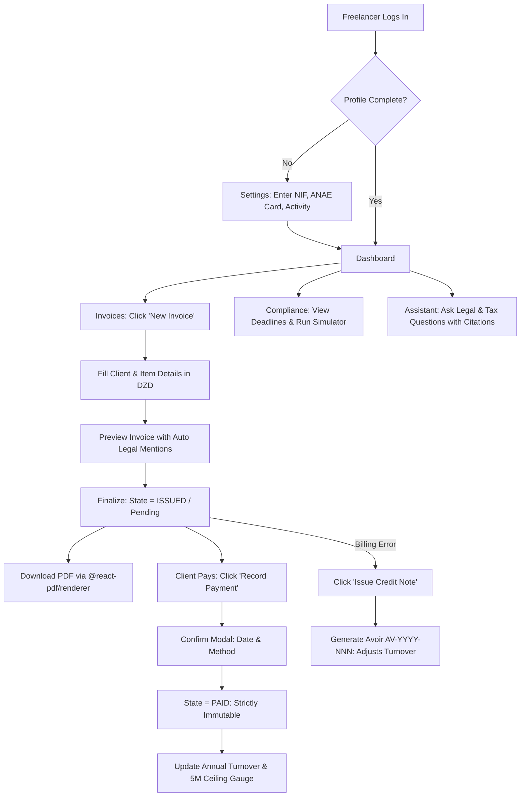

# MoukawilOS — Canonical Product Specifications

> **Status:** Finalized for Pre-development / Sprint 0  
> **Source of Truth:** Aligned with Figma Prototype, Algerian Legal Framework (*Loi n° 22-23*), and Team Alignment Decisions.  
> **Owner:** Aya (Product Lead)

---

## 1. Product Vision & Overview

**MoukawilOS** is a lightweight, local-first operational platform designed specifically for Algerian digital and creative freelancers operating under the national Auto-Entrepreneur statutory framework (*Loi n° 22-23 du 18 décembre 2022*).

Freelancers in Algeria face three major structural hurdles:
1. **Administrative Ambiguity:** Uncertainty surrounding the new auto-entrepreneur status, conflicting internet rumors (e.g. false monthly filings, quarterly CASNOS fees), and confusing tax declaration dates.
2. **Invoicing Compliance:** Lack of simple invoicing tools that automatically embed mandatory Algerian legal notices (*Décret exécutif n° 05-468*) and format Algerian Dinars (DZD) without inappropriate VAT calculations.
3. **Turnover Risk:** Fear of unintentionally exceeding the 5,000,000 DZD annual turnover ceiling and triggering mandatory radiation from the status.

MoukawilOS solves these problems by providing an integrated operational hub with automated statutory compliance, deterministic tax calculations, gapless sequential invoicing, and an AI regulatory assistant grounded exclusively in verified Algerian legal gazettes.

---

## 2. Target Personas

### Primary Persona: The Algerian Digital / Creative Freelancer
- **Demographics:** 20–35 years old; located in Algiers, Oran, Constantine, or working remotely across Algerian wilayas.
- **Roles:** Full-stack developers, mobile engineers, UI/UX designers, graphic artists, content creators, digital marketers.
- **Status:** Holds an official auto-entrepreneur card issued by the ANAE, or is currently registering.
- **Needs:** Fast invoicing in DZD, reassurance regarding tax deadlines, and clear visibility into annual revenue headroom.

### Secondary Persona: The Transitioning Independent
- Currently operating informally or under standard commercial status (EURL/SARL); seeking to evaluate if the 0.5% IFU auto-entrepreneur regime is advantageous for their service activity.

---

## 3. Scope of the MVP

The MVP includes strictly the following core modules:
1. **Compliance & Turnover Dashboard**
2. **Sequential Invoicing & Client-Side PDF Generation**
3. **Income & Payment Settlement Tracking (Cash-Basis Accounting)**
4. **Deterministic Compliance & Tax Calculation Engine**
5. **Regulatory RAG Assistant (Loi 22-23 Grounded Q&A)**
6. **Freelancer Profile & Settings Management**

---

## 4. Canonical Invoice Lifecycle

The platform enforces a strict, legally compliant 3-state invoice lifecycle:

```text
┌─────────────────┐       Finalize       ┌──────────────────┐    Record Payment    ┌─────────────────┐
│      DRAFT      │ ───────────────────► │  ISSUED (Pending)│ ───────────────────► │      PAID       │
│  (Brouillon)    │                      │   (En attente)   │   with confirmation  │  (Encaissée)    │
└─────────────────┘                      └──────────────────┘                      └─────────────────┘
         │                                         │                                        │
         ▼                                         ▼                                        ▼
  • Fully editable                         • Locked (No edit/delete)                • 100% Immutable
  • Excluded from turnover                 • Included in billed total               • Included in IFU & 5M ceiling
  • Excluded from tax                      • Awaiting payment                       • View & PDF download only
  • Can be deleted                         • Can be marked as Paid                  • Edit strictly blocked
                                           • Can issue Credit Note (Avoir)          • Error requires Credit Note
```

### Lifecycle Rules & Invariants
- **Equivalence:** `Pending` (in UI) = `ISSUED` (in backend and database).
- **Draft State:** Editable in all fields; excluded from all turnover, ceiling, and tax calculations.
- **Issued/Pending State:** Locked upon finalization. Sequential chronological number (`FA-YYYY-NNN`) is assigned and permanent. Direct editing and deletion are blocked.
- **Paid State:** **Strictly and permanently immutable.** Actions available: **View** and **Download PDF** only.
- **Payment Recording:** Transitioning from `ISSUED` to `PAID` requires explicit user confirmation via modal, capturing payment date and method.
- **Cash-Basis Principle:** Only `PAID` invoices count toward annual collected turnover for IFU tax and the 5M DZD ceiling (*CIDTA art. 282 sexies*).
- **Error Rectification:** Finalized invoices cannot be modified or deleted. Any mistake must be corrected by issuing a linked Credit Note (`AV-YYYY-NNN`, *Facture d'avoir*) per *Décret exécutif n° 05-468, art. 11*.

---

## 5. Detailed Feature Requirements

### 5.1. Dashboard & Ceiling Tracking
- **User Goal:** Monitor annual turnover against the 5M DZD legal ceiling, receive early warnings, and view fiscal deadlines.
- **Inputs:** Active fiscal calendar year.
- **System Behavior:**
  - Aggregates collected turnover strictly from `PAID` invoices for the active calendar year minus credit notes.
  - Computes ceiling percentage: `(Turnover / 5,000,000) * 100`.
  - Triggers preventative alert at 80% (4,000,000 DZD), explicitly labeled `[Fonctionnalité MoukawilOS - Alerte Préventive]`.
  - Evaluates consecutive years exceeding 5M DZD per *Loi 22-23 art. 13-14* (radiation warning at 3 consecutive years).
  - Displays top 3 approaching statutory deadlines with dynamic relative badges (`Dans X jours`, `En retard`, `Accomplie`).
- **Acceptance Criteria:** Zero reliance on unpaid invoices for tax calculations; clear visual distinction between MoukawilOS preventative 80% alert and statutory 5M ceiling.

### 5.2. Invoice Creation & Mandatory Mentions
- **User Goal:** Generate professional invoices complying with Algerian law.
- **Inputs:** Client details, issue date, due date, itemized line items (Description, Quantity, Unit Price in DZD).
- **System Behavior:**
  - Assigns unique, gapless sequential number `FA-YYYY-NNN`.
  - Injects seller profile data: Full Name, Address, Approved Activity Title, 15-digit NIF, ANAE Card Number.
  - Injects mandatory VAT exemption clause: *« Franchise de TVA — Article 282 sexies du CIDTA — TVA non applicable »*.
  - Injects commercial registry exemption: *« Dispensé d'immatriculation au Registre du Commerce (Loi n° 22-23) »*.
  - Calculates line subtotals and document total in DZD without VAT.
  - Blocks finalization if freelancer's 15-digit NIF or ANAE card number is missing from Settings.
- **Acceptance Criteria:** Numbers increment sequentially without gaps; VAT clause present verbatim; no tax line calculated.

### 5.3. Client-Side PDF Generation
- **User Goal:** Export a clean, standardized, printable A4 invoice.
- **Inputs:** Finalized Invoice ID.
- **System Behavior:**
  - Uses `@react-pdf/renderer` in the browser to compile the document into standard A4 format.
  - Injects two-column header (Seller vs Client), item table, DZD total, and 10-year archiving notice (*Code de commerce art. 12*).
  - Downloads directly as `Facture_FA-YYYY-NNN.pdf`.
- **Acceptance Criteria:** PDF renders accurately client-side without external network services; layout matches Figma prototype.

### 5.4. Deterministic Compliance Engine
- **User Goal:** Calculate exact tax and social security obligations with zero guesswork.
- **Inputs:** Annual turnover, CASNOS regime option.
- **System Behavior:**
  - **IFU Tax:** `Max(10,000 DZD, Turnover * 0.005)` (*CIDTA art. 282 sexies & 365 bis*).
  - **CASNOS Social Security:** Option A: Flat 24,000 DZD / year (*Décret 26-257*). Option B: 15% of income, clamped between floor of 43,200 DZD and ceiling of 864,000 DZD.
  - **Calendar Deadlines:** NIF (under 30 days), G12 (June 30), CASNOS (June 30), G12 bis (Jan 20 N+1).
  - Displays informational disclaimer reminding users that official filings occur on DGI and CASNOS portals.
- **Acceptance Criteria:** Passes all 12 baseline verification test cases; zero quarterly CASNOS or monthly filing dates.

### 5.5. Regulatory RAG Assistant
- **User Goal:** Obtain reliable, verified answers to Algerian legal, tax, and administrative questions.
- **Inputs:** Natural language user query (French, Arabic, English).
- **System Behavior:**
  - Vector similarity search over `pgvector` indexed with official legal texts.
  - LLM response constrained strictly to retrieved context.
  - Response includes specific statutory article citations and source status badges (`verified-official`, `secondary-only`, `conflicting`).
  - Intellectual honesty fallback triggered for unverified or unindexed questions.
- **Acceptance Criteria:** Zero hallucination of non-existent articles or tax rates; source citations accompany every legal statement.

---

## 6. User Journey & Flow



---

## 7. Explicitly Excluded Features (V1 Non-Goals)

To prevent scope creep, the following are **strictly out of scope for the MVP**:
- ❌ **Payment Gateways:** No automated online payment processing (SATIM, CIB, BaridiMob).
- ❌ **Expense Tracking & Deductions:** Auto-entrepreneurs under IFU are taxed on gross turnover; expense bookkeeping is legally irrelevant and excluded.
- ❌ **Multi-Currency Accounting:** All bookkeeping, metrics, and invoices are strictly in Algerian Dinars (DZD).
- ❌ **Commercial Registry (CNRC) Integration:** Auto-entrepreneurs are legally exempt from registration at the CNRC (*Loi 22-23 art. 2 & 11*).
- ❌ **Generic Social/Marketplace Features:** No client matching, freelancer community feeds, or job boards.
- ❌ **Direct Tax Portal Submissions:** Platform does not file directly with Jibayatic; it prepares the verified numbers for manual declaration.
